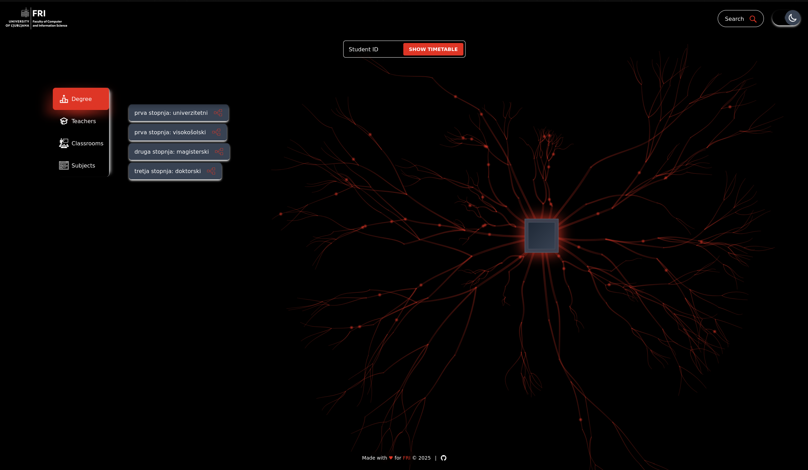
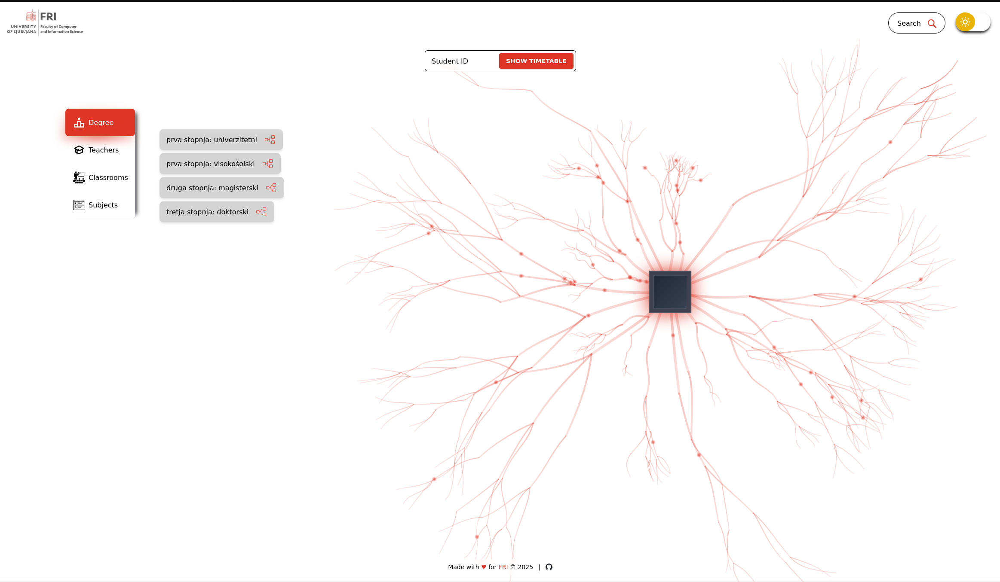
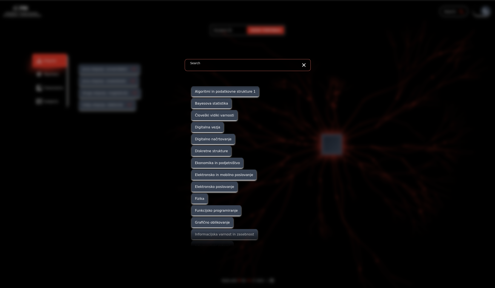
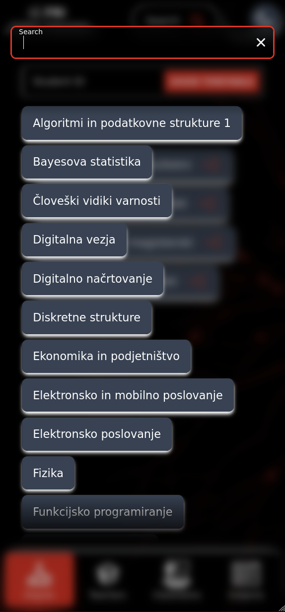
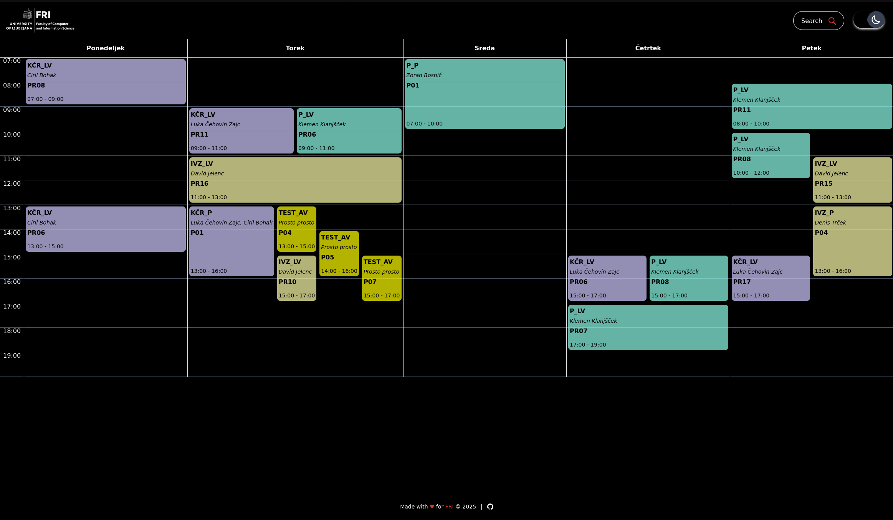
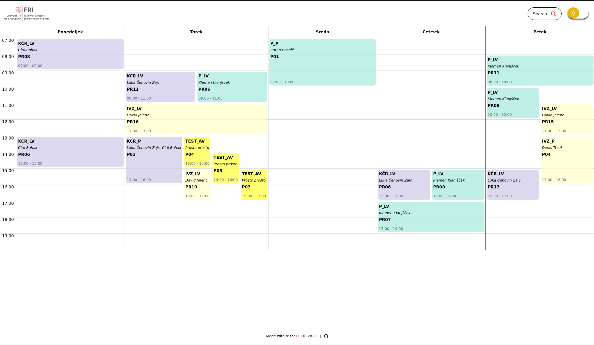
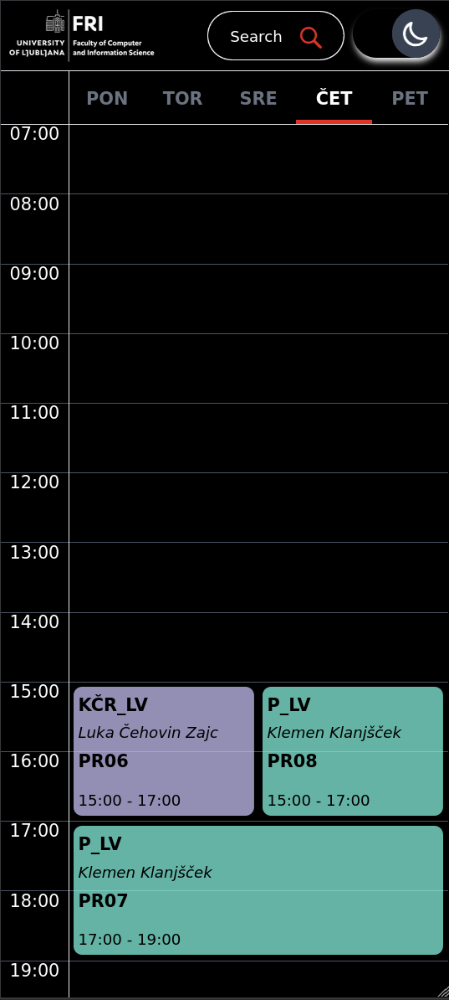
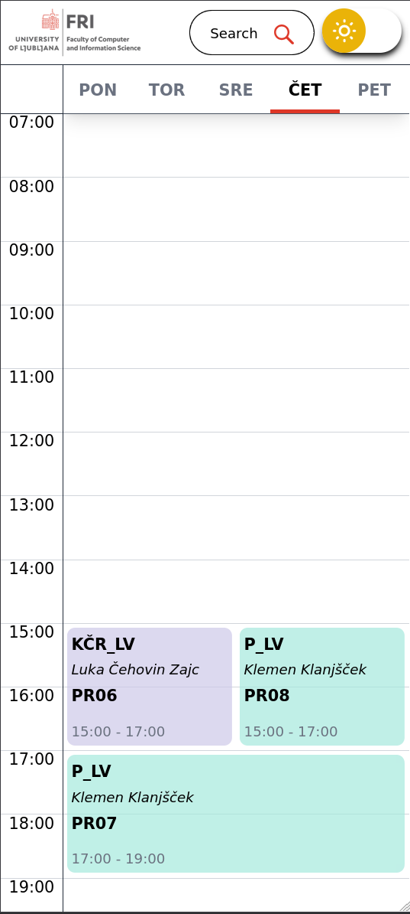

# FRI timetable

## Primary Components

- **Framework**: Built with [Qwik](https://qwik.dev/), with [React](https://react.dev/) integration.
- **Styling**: [Tailwind CSS](https://tailwindcss.com/) and [Tailwind CSS Animate](https://github.com/jamiebuilds/tailwindcss-animate).
- **Build Tools**: [Vite](https://vite.dev/) and [Bun](https://bun.sh/).
- **Language**: [TypeScript](https://www.typescriptlang.org/).
- **Utilities**: [Day.js](https://day.js.org/) (date handling), [Valibot](https://valibot.dev/) (validation), [Qwik LocalStorage](https://github.com/harshmangalam/qwik-localstorage), [Modular Forms](https://modularforms.dev/).
- **Development Tools**: [ESLint](https://eslint.org/), [Prettier](https://prettier.io/), [PostCSS](https://postcss.org/).
- **Runtime**: [Bun](https://bun.sh/), [Node.js](https://nodejs.org/).

## Dev

Enter:

```sh
devbox shell
```

Dev:

```sh
bun run start
```

Build using:

```sh
go-task build
```

## Preview

### Front page (Desktop)

<div style="display: flex; gap: 10px;">
  
  
</div>

<br>
<br>

<div align="left" style="column-gap: 10px; display: flex;">
  <div align="center" style="display: inline-block; width: 45%;">
    <p>Search:</p>
    
  </div>
</div>

---

### Front page (Mobile)

<div style="display: flex; gap: 10px;">
  
  
</div>

<br>
<br>

<div align="left" style="column-gap: 10px; display: flex;">
  <div align="center" style="display: inline-block; width: 45%;">
    <p>Search</p>
    
  </div>
  <div align="center" style="display: inline-block; width: 45%;">
    <p>Overflow example:</p>
    
  </div>
</div>

---

### Timetable page (Desktop)

<div style="display: flex; gap: 10px;">
  
  
</div>

---

### Timetable page (Mobile)

<div style="display: flex; gap: 10px;">
  
  
</div>
