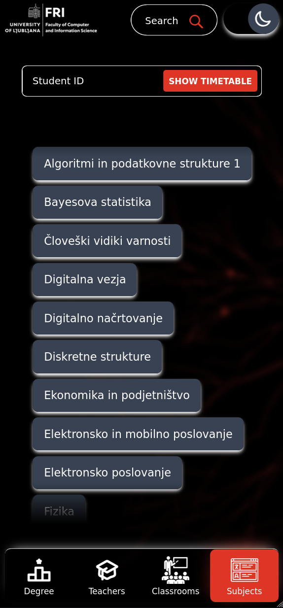

# FRI timetable

## Primary Components

- **Framework**: Built with [Qwik](https://qwik.dev/), [Qwik City](https://qwik.dev/docs/qwikcity/) (routing), with [React](https://react.dev/) (one element only) integration.
- **Styling**: [Tailwind CSS](https://tailwindcss.com/) and [Tailwind CSS Animate](https://github.com/jamiebuilds/tailwindcss-animate).
- **Build Tools**: [Vite](https://vite.dev/) and [Bun](https://bun.sh/).
- **Language**: [TypeScript](https://www.typescriptlang.org/).
- **Utilities**: [Day.js](https://day.js.org/) (date handling), [Valibot](https://valibot.dev/) (validation), [Qwik LocalStorage](https://github.com/harshmangalam/qwik-localstorage), [Modular Forms](https://modularforms.dev/).
- **Server**: [Fastify](https://fastify.dev/).
- **Runtime**: [Bun](https://bun.sh/), [Node.js](https://nodejs.org/).

## Dev

Enter:

```sh
devbox shell
```

Dev:

```sh
bun run start
```

Build using:

```sh
go-task build
```

## Preview

### Front page (Desktop)

| Black Mode Desktop | Light Mode Desktop |
|-------------------|-------------------|
|  |  |

| Search |
|--------|
|  |

### Front page (Mobile)

| Black Mode Mobile | Light Mode Mobile |
|------------------|-------------------|
|  |  |

| Search | Subjects menu |
|--------|---------------|
|  |  |

### Timetable page (Desktop)

| Timetable Black Mode Desktop | Timetable Light Mode Desktop |
|-----------------------------|----------------------------|
|  |  |

### Timetable page (Mobile)

| Timetable Black Mode Mobile | Timetable Light Mode Mobile |
|----------------------------|----------------------------|
|  |  |
